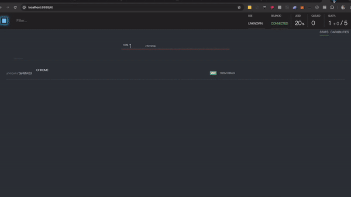

# WebdriverIO v7 DevTools Demo

This project demonstrates the use of WebdriverIO v7 with Chrome DevTools. The setup requires Node.js v14 and Docker to run a specific version of the Chrome/Chromium browser.

## Prerequisites

- Node.js v14
- Docker

## Setup Instructions

1. **Clone the Project Repository**

    ```bash
    git clone https://github.com/gromanas/wdio-devtools-demo.git
    ```

2. **Navigate to the v7 Folder**

    ```bash
    cd v7
    ```

3. **Install Dependencies**

    ```bash
    npm install
    ```

4. **Start Selenoid**

   - For M1 Processors:

       ```bash
       npm run infra:selenoid-m1
       ```

   - For Intel Processors:

       ```bash
       npm run infra:selenoid
       ```

5. **Run WebdriverIO Tests**

    ```bash
    npm run wdio
    ```

6. **Access the Selenoid UI**

   Open your browser and go to: [http://localhost:8888](http://localhost:8888) to view the container and access the test case.

## Demonstration



## Example Used for Demonstration

We used a PixiJS example for the demonstration. You can view the example at the following link:

[PixiJS Example - Container](https://pixijs.io/examples-v5/#/demos-basic/container.js)

For more information about PixiJS, visit the [official website](https://pixijs.com/).

## Chrome Extension

We are also using a Chrome extension that extends the Chrome DevTools panel for PixiJS. You can find the extension on the Chrome Web Store:

[PixiJS DevTools Extension](https://chromewebstore.google.com/detail/pixijs-devtools/aamddddknhcagpehecnhphigffljadon)

## Additional Information

For detailed WebdriverIO v7 setup instructions, refer to the [official documentation](https://v7.webdriver.io/docs/gettingstarted).

